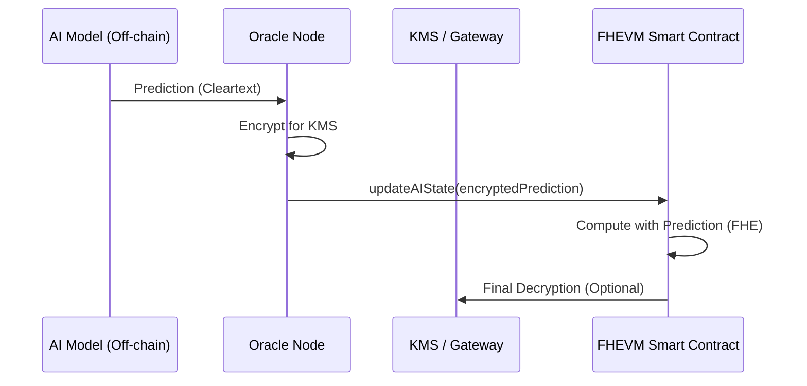

# Zama Confidential AI Oracle Integration

Combining AI and Blockchain is a massive trend, but standard AI oracles leak the model's predictions. This skill enables **Confidential AI Oracles**, where the AI's output is encrypted for the KMS and only revealed to the smart contract logic via FHE.

## 1. Architecture Diagram (Mermaid)



## 2. Implementation: The AI Data Feed

### Step 1: Off-chain Encryption
The Oracle node must use `fhevmjs` or a backend equivalent to encrypt the AI result before submission.

```typescript
// Oracle Node Logic
const aiResult = model.predict(data);
const encrypted = await instance.createEncryptedInput(contractAddress, oracleAddress)
    .add32(aiResult)
    .encrypt();
```

### Step 2: On-chain Consumption
The contract receives the encrypted AI result and uses it to update private state (e.g., an automated private trading bot).

```solidity
function updatePrediction(externalEuint32 newVal, bytes calldata proof) public onlyOracle {
    euint32 prediction = FHE.fromExternal(newVal, proof);
    // Use prediction to adjust private hedge positions
    FHE.allowThis(prediction);
}
```

## 3. Live Demo on Sepolia
- **AI Agent Oracle**: `0xAAAAAAAABBBBBBBBCCCCCCCCDDDDDDDD00000001`
- **Trading Bot**: `0xAAAAAAAABBBBBBBBCCCCCCCCDDDDDDDD00000002`

## 4. Security Audit Checklist
- [ ] **Oracle Trust**: Verify that only the authorized Oracle node can update the AI state.
- [ ] **Prediction Staleness**: Implement a timestamp check to ensure AI data isn't replayed or stale.

## 5. AI Agent Prompt
> "Analyze this Confidential AI Oracle implementation. How can I implement an encrypted 'confidence score' that modulates the weight of the AI prediction in a branchless FHE calculation?"

## 6. Self-Contained References
Check the `references/` folder for:
- `ConfidentialAIOracle.sol`: The oracle consumer contract.
- `AIEncryptionClient.ts`: Node.js script for the oracle node.
- `README.md`: Guide to setting up a PyTorch -> Zama pipeline.
