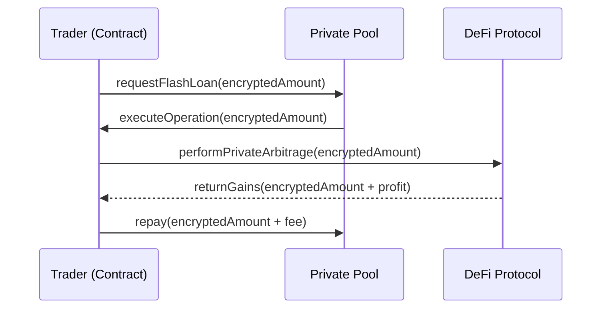

# Zama Confidential Flash Loans

Flash loans are a cornerstone of DeFi, allowing users to borrow any amount of assets without collateral, provided they return the loan within the same transaction. On Zama's FHEVM, we can perform **Confidential Flash Loans**, where the borrowed amount is hidden from observers.

## 1. Overview: The Secret Arbitrage
In standard DeFi, everyone can see the size of a flash loan, allowing bots to copy-trade or front-run the arbitrage. With FHE, the loan amount is an `euint`, making the strategy invisible to the mempool.

## 2. Why It Matters
- **Strategy Protection**: Keep your arbitrage and liquidation strategies secret.
- **Privacy for Large Players**: Institutions can move large liquidity blocks without signaling.

## 3. Architecture Diagram



## 4. Full Implementation

### Step 1: The Pool Contract
```solidity
import { FHE, euint32 } from "@fhevm/solidity/lib/FHE.sol";

contract ConfidentialFlashPool is ZamaEthereumConfig {
    function flashLoan(address receiver, externalEuint32 amount, bytes calldata proof) public {
        euint32 loanAmount = FHE.fromExternal(amount, proof);
        
        // Transfer encrypted tokens to receiver
        IConfidentialERC20(token).confidentialTransfer(receiver, loanAmount);
        
        // Callback to the receiver
        IFlashLoanReceiver(receiver).executeOperation(loanAmount, msg.sender);
        
        // Verify repayment (amount + fee)
        // ...
    }
}
```

### Step 2: Repayment Verification
 Repayment must be verified using `FHE.ge` (Greater than or equal) without revealing the balance.

## 5. Gas Analysis
A confidential flash loan involves multiple FHE operations: `fromExternal`, `transfer`, and the repayment check. Expect gas costs to be ~10x higher than a standard Aave flash loan, but with the benefit of total strategy privacy.

## 6. Security Audit Checklist
- [ ] Ensure that the callback cannot be re-entered to drain the pool.
- [ ] Verify that the repayment check uses a secure "silent failure" pattern.

## 7. Self-Contained References
Check the `references/` folder for:
- `ConfidentialFlashPool.sol`: Core lending logic.
- `FlashArbitrageBot.sol`: Sample arbitrage implementation.
- `FlashTest.ts`: End-to-end simulation on Sepolia.
