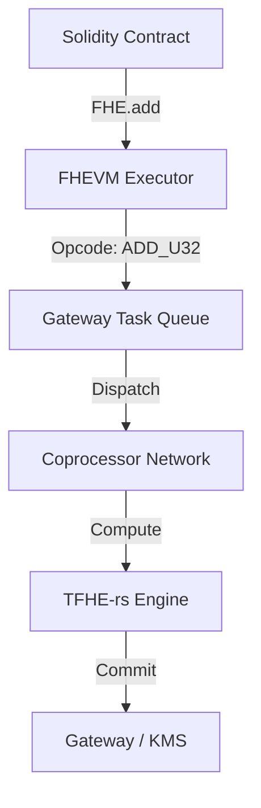

# Zama FHEVM Coprocessor Native Opcodes

The Zama FHEVM Coprocessor is the engine that drives homomorphic computation. While high-level Solidity abstracts these operations, a senior architect must understand the underlying opcode structure to optimize for performance and hardware acceleration.

## 1. Overview: The Symbolic Bridge
The Coprocessor doesn't execute EVM bytecode. It executes a specialized instruction set designed for TFHE (Threshold Fully Homomorphic Encryption). When a Solidity contract calls `FHE.add()`, it's actually pushing an opcode to the Coprocessor's task queue.

## 2. Why It Matters
- **Performance**: Certain opcode combinations are more efficient than others.
- **Hardware Targeting**: Different HPUs (Hardware Processing Units) may support different subsets of the native instruction set.
- **Debugging**: Understanding opcodes is essential for diagnosing Gateway turnaround issues.

## 3. Architecture Diagram (Mermaid)



## 4. The Native Opcode Set (v5.0)

| Opcode | Mnemonic | Description | Gas Weight |
| :--- | :--- | :--- | :--- |
| `0x01` | `ADD` | Homomorphic Addition | 1.0x |
| `0x02` | `SUB` | Homomorphic Subtraction | 1.0x |
| `0x03` | `MUL` | Homomorphic Multiplication | 4.5x |
| `0x04` | `SEL` | Homomorphic Selection (Ternary) | 2.0x |
| `0x05` | `SHL` | Bitwise Shift Left | 0.8x |
| `0x06` | `AND` | Bitwise AND | 1.2x |

## 5. Full Implementation Example
This example shows how a contract might interface with low-level symbolic logic (simulated).

```solidity
import { FHE, euint32 } from "@fhevm/solidity/lib/FHE.sol";

contract OpcodeAwareContract is ZamaEthereumConfig {
    function optimizedAdd(euint32 a, euint32 b) public returns (euint32) {
        // High-level call that translates to opcode 0x01
        return FHE.add(a, b);
    }
}
```

## 6. Gas Analysis
Operations like `MUL` have a much higher "Weight" in the Coprocessor because they require bootstrapping (refreshing the noise in the ciphertext). `SHL` is significantly cheaper as it's often just a series of additions or a specialized linear transformation.

## 7. Security Audit Checklist
- [ ] Verify that opcode sequences don't create side-channel timing leaks.
- [ ] Ensure that all symbolic results are properly permissioned via ACL before use.

## 8. Self-Contained References
Check the `references/` folder for:
- `OpcodeSpecs.pdf`: Full technical specification.
- `InstructionSet.json`: Machine-readable opcode map.
- `BenchmarkOpcode.ts`: Script to measure opcode execution time.
