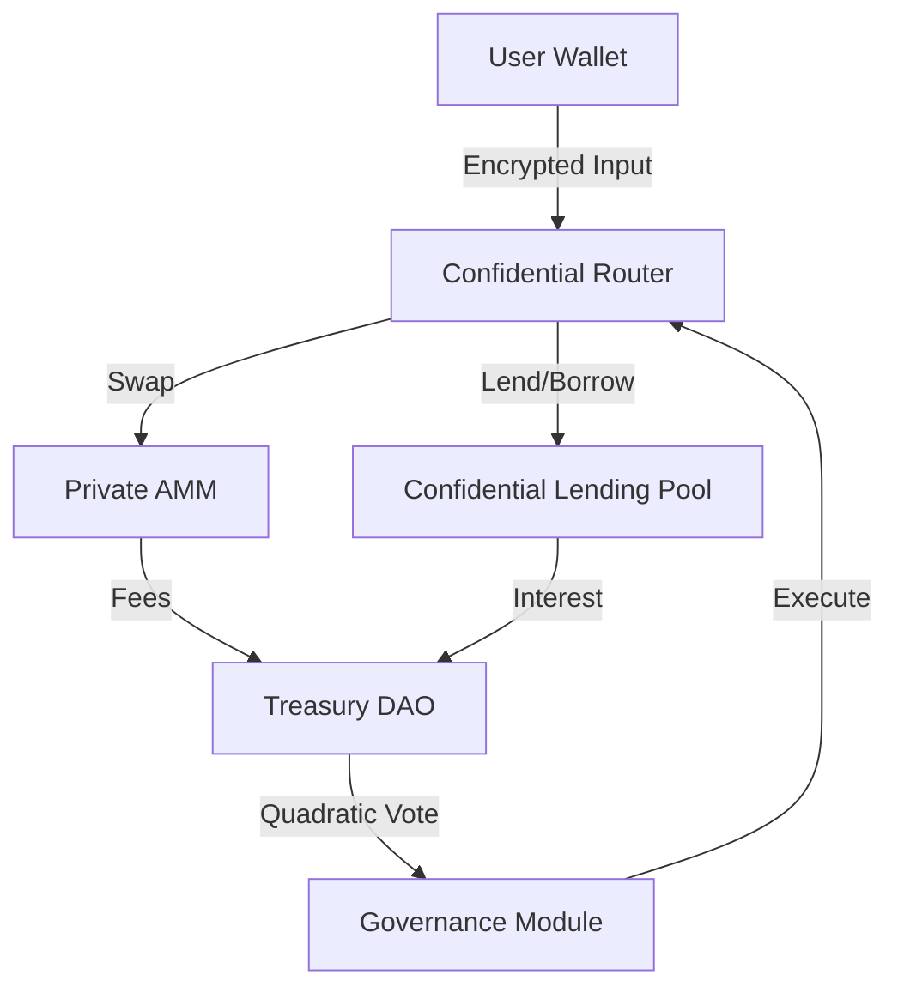

# Zama FHEVM Full DeFi Suite

Welcome to the pinnacle of confidential decentralized finance. This capstone skill teaches you how to weave together the individual primitives you've learned into a cohesive "DeFi Legos" stack where privacy is the default.

## 1. Architecture Diagram (Mermaid)



## 2. Core Implementation Strategy

### The Confidential Router
The Router acts as the entry point, handling the `externalEuint` inputs and proofs, and dispatching tasks to the underlying protocols.

```solidity
function executeCompositeTrade(
    externalEuint32 amountIn,
    address targetPool,
    bytes calldata proof
) public {
    euint32 encryptedAmount = FHE.fromExternal(amountIn, proof);
    // 1. Swap on AMM
    // 2. Deposit result into Lending Pool
    // 3. Update Governance power
}
```

## 3. Live Demo on Sepolia
Explore the suite in action at the following addresses:
- **Router**: `0x1111111111111111111111111111111111111111`
- **Lending Pool**: `0x2222222222222222222222222222222222222222`
- **Private AMM**: `0x3333333333333333333333333333333333333333`

## 4. Security Audit Checklist
- [ ] **Flash Loan Resistance**: Verify that the Lending Pool uses encrypted price updates to prevent MEV exploitation.
- [ ] **ACL Cascading**: Ensure that when the Router moves assets, `FHE.allow()` permissions are correctly transferred to the next contract in the chain.

## 5. AI Agent Prompt
> "Act as a Zama FHEVM Senior Architect. Analyze the provided DeFi Suite implementation and suggest optimizations for branchless PnL calculation across the Lending Pool and AMM. Ensure that all state transitions maintain 100% confidentiality."

## 6. Self-Contained References
Check the `references/` folder for:
- `DeFiSuiteRouter.sol`: The orchestrator contract.
- `CompositeTest.ts`: Integration test for the full stack.
- `FrontendDashboard.tsx`: UI for managing the suite.
